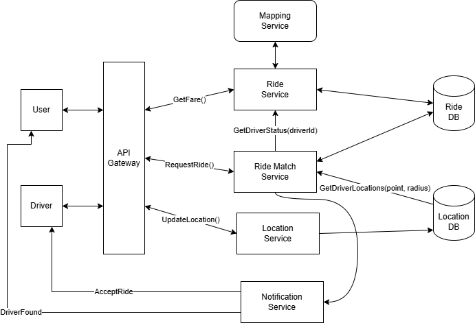
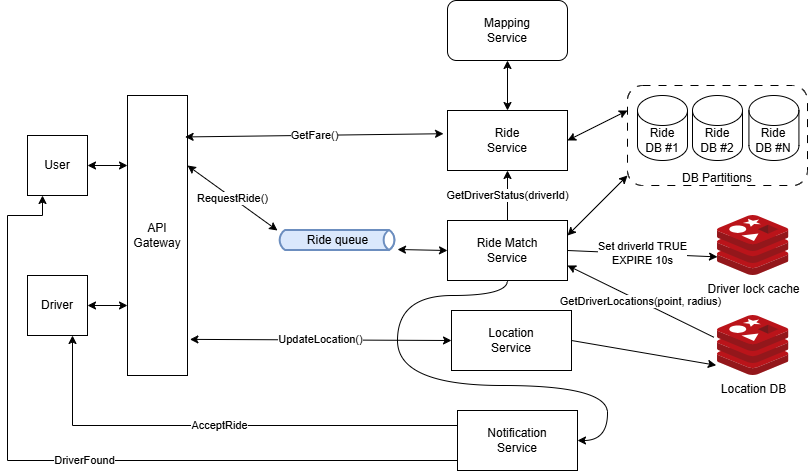

# ДЗ 1. Анализ референсной архитектуры — решение

> Условие: [../Задание.md](../Задание.md) · Чек-лист: [../Чеклист.md](../Чеклист.md)
> Схемы складывайте в [diagrams/](diagrams/).

## Выбранная архитектура

_Сервис такси._

Система заказа такси. Пользователь, с помощью приложения, указывает
желаемый маршрут, получает оценку стоимости поездки и вызывает такси,
оформляя заказ. Система подбирает ближайших свободных водителей и предлагает им
этот заказ. После принятия заказа одним из водителей, пользователь
уведомляется о времени прибытия автомобиля.

Оценки нагрузки: 

Общее количество водителей в сервисе (на основе открытых данных Я.Такси) - 1,5-2 млн. водителей.  
Uber ~ 6 млн. водителей.
Общее количество одновременно работающих водителей - 700-900 тысяч (Я. Такси), до 3 млн (Uber).
Каждое такси отсылает свое местоположение раз в 5 секунд.

## 1. Компоненты

Высокоуровневый дизайн системы

1. Приложение-клиент пользователя - отвечает за формирование маршрута
поездки (начальная, конечная точки), показ стоимости поездки,
отображение информации о местоположении такси.
2. Приложение-клиент водителя - отвечает за передачу данных о текущем
местоположении такси, вывод уведомлений о новых заказах.
3. API Gateway - API-шлюз, баллансировщик нагрузки, аутентификация
пользователей системы, ограничение количества запросов к системе (rate
limiter).
4. Сервис картографии - формирование критериев для оценки стоимости
поездки (например протяженность и время маршрута). В рамках проектирования нашей архитектуры будем считать этот сервис внешним.
5. Сервис поездок - оценка стоимости маршрута на основании критериев
полученых от сервиса картографии и ряда других параметров (уровень
спроса, погода, и т.п.)
6. Сервис подбора водителя - обрабатывает новые заказы и выбирает
оптимального водителя (близость, рейтинг, и т.д.)
7. Сервис локаций - принимает обновление локации от такси, сохраняет
новую локацию в БД.
8. Сервис нотификаций - отвечает за отправку уведомлений в режиме
реального времени водителю для принятия нового заказа, а также клиенту при назначении водителя на поездку.

## 2. Потоки данных

Ключевые сущности системы:
- Клиент
- Водитель
- Местоположение
- Поездка
- Расчет поездки 

### Клиент (User)

- userId- идентификатор клиента
- ...

### Водитель (Driver)

- driverId -идентификатор водителя
- ...

### Местоположение (Location)

- latitude - широта
- longitude - долгота

### Поездка (Ride)

- rideId - идентификатор поездки
- userId - идентификатор клиента
- driverId - идентификатор водителя
- startLocation - начало маршрута
- finishLocation - конец маршрута
- status - статус поездки
- ...

### Оценка поездки (Fare) 

- rideId - идентификатор поездки 
- price - стоимость поездки

### API:

#### Запрос стоимости поездки клиентом

POST  
/ride/fare-estimate -> Fare  
Body: 
{
	startLocation,
	finishLocation
}

Клиент запрашивает стоимость поездки из начальной в конечную точку.Результатом ему возвращается оценка стоимости поездки (включая идентификатор поездки).

#### Бронирование поездки клиентом

PATCH  
/ride/request -> 200  
Body: 
{
	rideId
}

Клиент принимает условия поездки.

#### Обновление текущего местоположения такси

POST  
/location/update -> 200  
Body: 
{
	latitude,
	longitude
}

Фоновый процесс в приложении такси, для периодической отправки текущих координат на сервер приложения для понимания где какие машины находятся и выбора наиболее подходящие с точки зрения местоположения.

#### Запрос на принятие поездки водителем

PATCH  
/ride/driver/accept -> 200  
Body: 
{
	rideId,
	accept:(true|false)
}

Запрос водителю на принятие поездки. Водитель может либо принять, либо отклонить поездку.

#### Запрос на получение информации о текущем местоположении такси

POST  
/ride/location -> Location  
Body: 
{
	rideId
}

Запрос на получение текущего местоположения такси для отображения у заказчика.

## 3. Проблемы и решения

### Проблема консистентности при подборе водителя для поездки.

**Большая нагрузка на запись в БД локаций.**

При отправке координат каждые 5 секунд водителем мы можем достигнуть 600 тысяч RPS на запись. Для  обработки такого числа запросов мы можем развернуть Redis кластер, однако все равно возможны сбои которые приведут к невозможности обработки такого числа запросов. Нужно уметь гибко подходить к вопросу частоты отсылки координат. Например если такси стоит на месте или крайне медленно движется в пробке то частоту обновления можно без потери точности уменьшить в разы. Ответственность за определение частоты рассылки в этих условиях может взять на приложение-клиент. Это поможет снизить общую нагрузку на систему, но в пиковые моменты она все равно может оказаться чрезмерной. Для разрешения таких ситуаций нам нужно решение которое бы позволяло динамически менять частоту отправки локации приложению клиенту в зависимости от текущей нагрузки на систему. Такое поведение укладывается в рамки gracefull degradation.

**Нам необходимо обеспечивать гарантии что один водитель не будет назначен на две поездки одновременно и на одну поездку не будет назначено более одного водителя.**

Гарантии на одного водителя на заявку мы можем решить на уровне обработчика списка запросов на поездку, просто запретив обрабатывать одну заявку параллельно.  
С блокировкой водителя решение более сложное. Очевидная реализация с простановкой статуса *подбор* водителю в БД имеет ряд существенных минусов. Мы не можем гарантировать что откат статуса в случае отсутствия реакции со стороны водителя или сбоя в приложении произойдет точно в указанный таймаут. Более того в случае сбоя нам нужен отдельный процесс который по косвенным признакам проверял бы зависание статуса *подбор* и откатывал его. Дополнительные сервисы также могут сбоить что приводит нас к тому же - отсутсвие гарантий на время таймаута по водителю. Мы имеем серьезные риски исключить водителя из работы надолго и даже не сразу понять этого. Именно поэтому при подборе мы будем использовать распределенную блокировку с помощью Redis с ключом driverId и таймаутом на время жизни кэша. Наличие ключа указывает нам на то что данный водитель уже задействован сервисом подбора и в настоящий момент ему нельзя предлагать другую поездку. Наличие таймаута гарантирует нам что по его истечению запись удалится из базы и водитель будет вновь доступен для подбора. Кроме того это снижает транзакционную активность в основной БД.      
Альтернативным решением могло бы быть использование в качестве основной СУБД с возможностю указания времени жизни для записи. Тогда не потребуется развертывание Redis кластера для мэтчинга.

**Запросы на подбор водителя превышают пропускную способность нашего горизонтально смаштабированного  пула сервисов подбора водителя.** 

Т.к. сервис подбора работает ощутимо долгое время (речь идет о десятках и сотнях секунд) мы можем оказаться в ситуации когда для пришедшего запроса на поездку у нас нет свободного сервиса мэтчинга.
Для решения этой проблемы добавим очередь запросов на мэтчинг. Кроме того, для решения проблемы с подвисанием очереди из за сложных геопараметров мэтчинга некоторых заявок в очереди (например запрос такси в глухую деревню блокирует обработку запросов в центре Москвы, хотя очевидно, что запросы в центре будут гораздо быстрее обработаны), можно разбивать очередь по геопризнаку. В случае ощутимого возрастания нагрузки мы можем горизонтально отмаштабировать сервис мэтчинга.

## 4. Вопросы к авторам архитектуры

1. Какие критерии используются в вашей системе для расчета стоимости поездок. (Интересует насколько они могут быть нетривиальными и неочевидными).
2. Используете ли вы партицирование для геоданных и каким образом при таком подходе решается проблема граничных точек? (Например населённый пункт находится на границе двух областей, будет ли он обработан используя водителей только из одной области?)
3. Каким образом происходит фильтрация данных о геолокации такси? (Имеется в виду работа с выбросами гео-координат).
4. Исходя из чего производится расчет частоты отсылки координат такси? Может ли система подстройки частоты отправки координат рабоать в полностью автоматическом режиме на основе сбора ключевых метрик подсистем задействованных в сборе координат?
5. Каким образом система обрабатывает ситуацию при которой в заданой области поиска нет ни одного свободного такси по заданным критериям?
6. Каким образом производится расчет стоимости если сервис картографии недоступен? Естькакие-то примитивные эвристики? Статистические данные? Расчет на основе предыдущих поездок?
7. Если сервис обработки местоположения по какой-то причине не работает значительное время, есть ли смысл в накоплении данных по геолокации такси? Имеется ли смысл в добавлении очереди для хранения записей геолокации? И если такой смысл есть (а я уверен что есть), то как потом могут быть использованны эти данные.
8. Каким образом тестируется система? Я немного читал об использовании реальных данных поездок для моделирования тестовой нагрузки, интересно было бы узнать об этом более подробно.
9. Понятно что представленная система оставляет за бортом множество вопросов решаемых в реальных системах. Какое число сервисов задействовано в вашей системе? Интересно для осознания маштабов системы. 