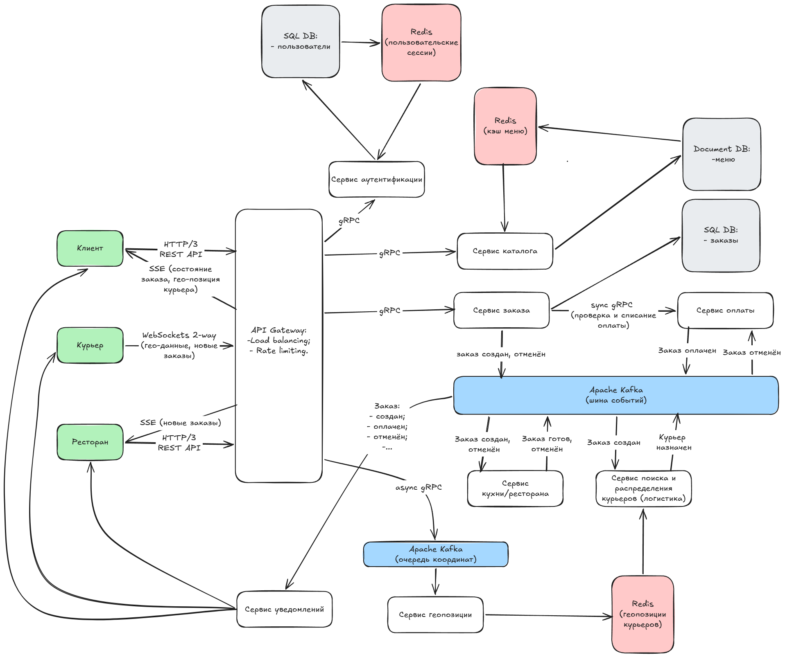

# ДЗ 2. Проектирование взаимодействия сервисов — решение

> Условие: [../Задание.md](../Задание.md) · Таблица протоколов: [../Таблица протоколов.md](../Таблица%20протоколов.md)
> Схемы складывайте в [diagrams/](diagrams/).

## Выбранная система

_Доставка еды._

Я с Delivery Club не знаком, поэтому опирался в описании системы скорее на Яндекс Еда, но думаю в разрезе требований к ДЗ это не принципиально. 

### Функциональные требования к системе

Клиент:
- Поиск и фильтрация: Просмотр списка доступных ресторанов в радиусе доставки и их меню.
- Управление корзиной: Добавление, удаление и изменение количества позиций.
- Оформление  заказа: Размещение заказа с выбором адреса доставки и онлайн-оплатой.
- Трекинг заказа: Отслеживание статуса заказа (создан, готовится, в пути) и геолокации курьера на карте.

Ресторан:

- Управление каталогом: Создание, обновление меню (блюда, цены, стоп-листы) и установка графика работы.
- Управление заказами: Получение уведомлений о новых заказах, их принятие в работу и смена статусов приготовления.

### Нефункциональные требования к системе

Производительность и нагрузка:
- MAU > 20 млн
- средняя нагрузка на точке входа 500 т. RPS, пиковая нагрузка на точке входа 650 т. RPS 
- Поддержка средних нагрузок с пиками до 15 000 RPS на конечных сервисах.
- Обновление координат курьера: доставка на экран клиента в пределах 1–2 секунд.

Доступность и Надежность (Availability & Reliability):
- Сбой в работе сервиса логистики или ресторанов не должен мешать клиентам просматривать каталог и оформлять новые заказы.
- Гарантия доставки сообщений: Использование модели At-least-once (минимум один раз) для доставки оплаченных заказов на кухню ресторана. Без риска утери данных.

Горизонтальное масштабирование: Автоматическое масштабирование (Auto-scaling) stateless-сервисов (API Gateway, каталог, заказы) при скачках нагрузки.

###

## 1. Декомпозиция

Мобильные приложения и Web: 
- Клиентское приложения;
- Курьерское приложения;
- Панель управления ресторана (управление меню, отслеживание заказов).

API Gateway: 
- Точка входа для всех запросов (например, с использованием Nginx или Kong);
- Балансировка нагрузки и маршрутизация;
- Rate limiter для отказоустойчивости в случае пиковых нагрузок.

Сервисы:
- Сервис аутентификации (Вход по SMS/паролю, регистрация, генерация токенов, обновление токенов , блокировка пользователей);
- Сервис каталога (хранение информации о ресторанах и меню);
- Сервис заказа (создание, управление статусами: Создан → Оплачен → Готовится → Доставляется → Доставлено);
- Сервис оплаты (взаимодействие с платежным шлюзом, заморозка и фактическое списание средств с карты);
- Сервис ресторана (получает оплаченные заказы, проверяет возможность их выполнения, рассчитывает время приготовления заказа, фиксирует этапы готовности заказа (Принят → Готовится → Собран/Упакован → Готов к выдаче));
- Сервис геопозиции (обработка координат курьеров для отслеживания в реальном времени);
- Сервис поиска и распределения - логистический сервис (алгоритмы подбора оптимального курьера для заказа).
- Сервис уведомлений (Push-уведомления и/или SMS).

Базы данных:
- PostgreSQL или другая реляционная база для реляционных данных (пользователи, заказы).
- Redis для кэширования меню и сессий пользователей, геопозиций курьеров.
- MongoDB или Elasticsearch для каталога блюд.

Брокер сообщений:  
- Apache Kafka или RabbitMQ для асинхронной обработки событий (создание заказа, оплата заказа, отмена заказа, принятие заказа рестораном, статусы готовности заказа в ресторане, курьер назначен, курьер прибыл в ресторан, курьер забрал заказ, заказ доставлен).

## 2. Протоколы

__Внешнее взаимодействие (Клиент / Курьер / Ресторан ──► API Gateway)__

### HTTP/2 / HTTP/3 (через REST API) 

Где применяется:
- Авторизация, просмотр каталога, составление корзины, создание заказа, создание/редактирование меню.

Обоснование:
HTTP/3 использует UDP. Если курьер заходит в лифт или подвальное помещение ресторана, соединение не рвется и не переустанавливается с нуля (в отличие от TCP handshake), что критично для мобильных сетей.
- Мультиплексирование. Позволяет загружать картинки блюд и меню параллельно через одно TCP/UDP соединение, снижая нагрузку на клиентское устройство.

### WebSockets

Где применяется: 
- Передача координат курьера (каждые 3–5 секунд) на сервер и стриминг этих координат на экран клиента («курьер на карте»).

Обоснование:
- Двунаправленный real-time: Постоянное HTTP-подключение (long-polling) при 0,7-0,8 млн DAU создаст большой оверхед на заголовках пакетов. WebSockets снижает сетевой трафик, так как соединение устанавливается один раз, а затем передаются чистые бинарные или JSON-данные.

### Server-Sent Events (SSE)

Где применяется: 
- Обновление статуса заказа на экране пользователя, получение текущих координат курьера для отрисовки на экране пользователя. 

#### Обоснование:
- Экономия ресурсов сервера: SSE  потребляет меньше памяти на сервере чем WebSockets и ориентирован строго на односторонний стриминг (сервер ──► клиент). Клиенту не нужно отправлять данные обратно, ему нужно лишь слушать изменения статуса и получать координаты курьера.

__Внутреннее взаимодействие (Микросервис ──► Микросервис)__

При масштабе 10-15 тысяч RPS REST (HTTP/1.1 + JSON) может создать высокий overhead на сериализацию / десериализацию данных. Поэтому кажется разумным использование более эффективных протоколов обмена данными.

### gRPC

Где применяется: 

- Синхронные межсервисные запросы:
    - аутентификация пользователя;
    - сервис заказов проверяет доступность денег в сервисе оплаты.

Обоснование:
- Низкая задержка: Protobuf — бинарный протокол. Cериализуется в разы быстрее, чем JSON, и передает пакеты минимального размера.
- Строгая типизация: Контракты между микросервисами фиксируются. Это исключает ошибки несовместимости форматов данных при деплое разных команд.

### Асинхронный Event-Driven (Apache Kafka / RabbitMQ)

Где применяется: 
- Передача заказа по цепочке жизненного цикла: 
    - _Новый заказ._ Сервис заказа ──► [Broker] ──► Сервис ресторанов / Сервис поиска и распределения курьеров.
    - _Отмена рестораном заказа._ Сервис ресторана ──► [Broker] ──► Сервис заказа / Сервис оплаты.

Обоснование:
- Отказоустойчивость и буферизация: При падении сервиса логистики, сервис заказа не упадет вслед за ним. Он продолжит принимать заказы от клиентов и складывать события в брокер сообщений. Как только сервис логистики восстановится, он вычитает очередь и назначит курьеров. 
- Гарантия доставки (At-least-once / Exactly-once): При правильной настройке брокера сообщений событие не будет потеряно даже при частичном отказе брокера.

Внутренние сервисы синхронно взаимодействуют только в операциях требующих немедленого ответа, без какового последующее взаимодействие не будет иметь смысла, например:
- аутентификация пользователя;
- создание заказа;
- блокировка и списание денег на карте.

## 3. Схема взаимодействия

## 4. API-контракты

[Open API](openapi.yaml)

## 5. Асинхронность

Асинхронная модель взаимодействия применяется для процессов, которые могут выполняться параллельно, занимают много времени или не требуют немедленного ответа клиенту.

- Сервис заказов → Сервис уведомлений (Notification Service): Отправка push-уведомлений клиенту («Заказ принят», «Курьер в пути»). Очередь гарантирует доставку, даже если сервис уведомлений временно недоступен.

- Сервис заказов → Сервис поиска и распределения (логистический): Передача события «Заказ оплачен, нужно найти курьера». Поиск курьера может занять несколько минут, сервис заказов не должен ждать этого ответа синхронно.

- Приложение курьера → Сервис геопозиции: Передача координат курьера происходит раз в 5-10 секунд. Потеря одной или нескольких точки не критична, данные шлются асинхронно для снижения нагрузки.

## 6. Паттерны

### Idempotency Key
Защита от дубликатов. Если у пользователя завис интернет, и он нажал кнопку «Оплатить» три раза, API Gateway пропустит только первый запрос с уникальным ключом идемпотентности, а остальные два заблокирует, защищая от повторного списания денег.

### Rate Limiting
Ограничение частоты запросов на API Gateway. Спасает систему от  DoS-атак на тяжелые эндпоинты (например, поиск курьера).

### Saga
Для управления распределенными транзакциями. Оформление заказа вовлекает cервисы заказов, оплаты и ресторанов. Если оплата прошла, а ресторан отклонил заказ, сага запускает компенсирующую транзакцию (разблокировку денег).

### CQRS
Разделение операций записи и чтения. В сервисе каталога запись (добавление блюда рестораном) происходит редко, а чтение (миллионы клиентов смотрят меню) — постоянно. CQRS позволяет оптимизировать БД для чтения отдельно от БД для записи.

### Event Sourcing
Хранение истории заказа не в виде финального статуса, а в виде неизменяемой последовательности событий (Создан → Оплачен → Готовится → Доставляется → Доставлено). Это дает 100% аудит для разбора споров и позволяет восстановить состояние системы при сбоях.