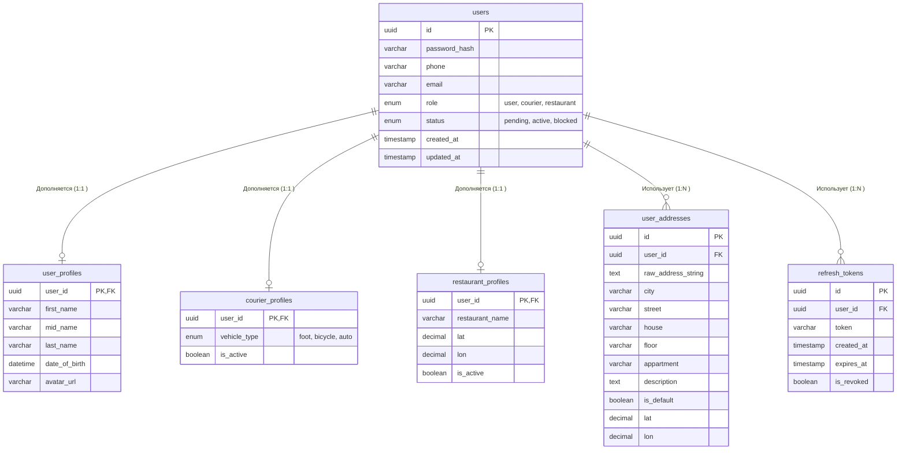
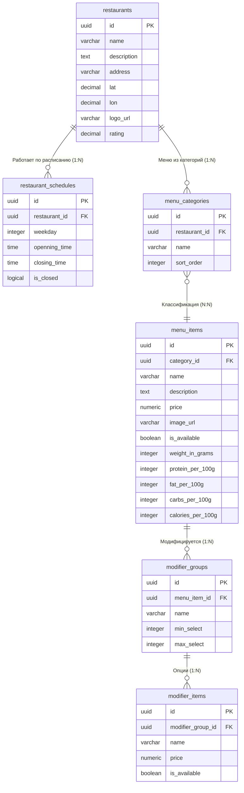
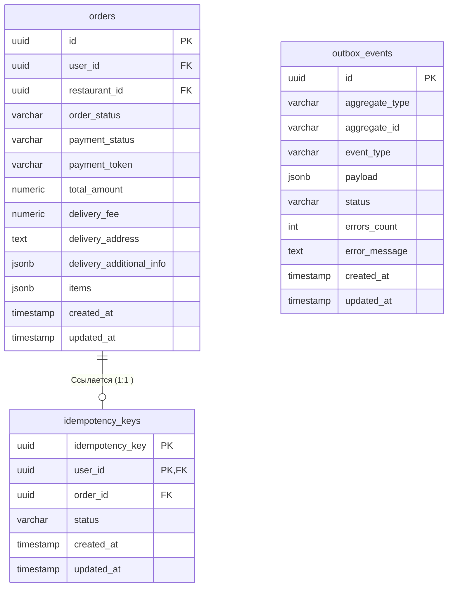
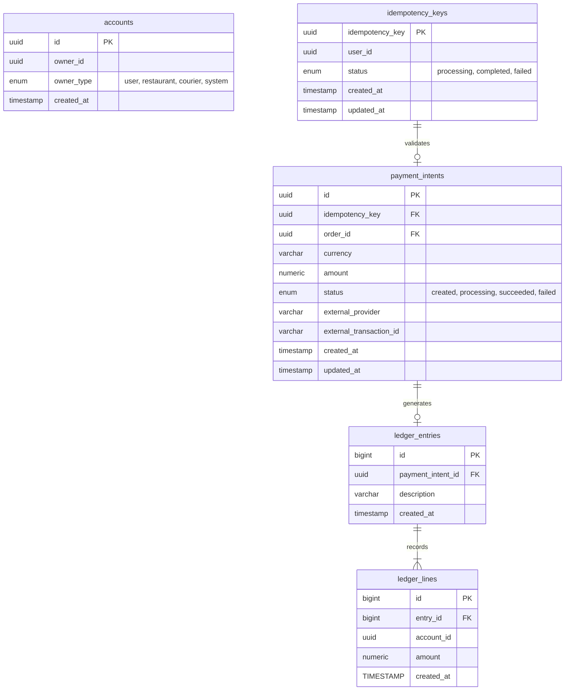

# ДЗ 3. Проектирование хранения данных — решение

> Условие: [../Задание.md](../Задание.md)
> Шаблоны: [сравнение БД](../Таблица%20сравнения%20БД%20с%20критериями%20выбора.md) ·
> [кэширование](../Чек-лист%20стратегий%20кэширования.md) ·
> [шардирование](../Шаблон%20схемы%20шардирования.md). Схемы — в [diagrams/](diagrams/).

> Выполняется для системы, выбранной в ДЗ 2.

## 1. Модель данных

_Какие данные хранит каждый сервис (ER-диаграмма или описание)._


> [!NOTE]
> 1. Возможны некоторые неточности в выборе типов поскольку я последние 20 лет работаю со специфической БД, с немного отличной от стандартного SQL типизацией.
> 2. В силу опять же работы с этой БД, мы не используем UNIQUE constraint, нет навыка, я их не прописывал.  
> 3. В качестве реализации UUID предпочтительнее использовать UUIDv7 т.к. она значительно эффективнее с точки зрения индексов построенных на b-trees.

### Сервис аутентификации

Хранит информацию о пользователях системы, служебную информацию для осуществления аутентификации пользователей.




### Сервис каталога

Хранит информацию о ресторанах, их зонах доставки и меню. 

Я исходил из того, что в меню ресторана могут быть разделы с популярными / акционными товарами которые могут также встречаться в других категориях поэтому сделал связь между разделами и блюдами многие ко многим.

Кроме того добавил группы модификаторов для блюд, что позволяет расширить возможности заказа за счет кастомизации блюда (например для бургеров добавлять не добавлять доп. наполнители, выбор булочки и т.п.).



> [!NOTE]
>ER диаграмма не точно отражает представление документа в БД, проэтому также добавил образец [документа](./restaraunt_doc.json) хранимого в БД. В образце "Фирменный Бургер" одновременно находится в основной категории "Бургеры" и в акционной категории "Комбо и Акции".

Хранение в виде документа позволяет легче по сравнению с SQL БД менять структуру меню, расширяя и модернизируя ее по необходимости.

### Сервис заказа

Т.к. я предпочел гибкую структуру хранения для меню ресторана, то развивая этот подход в сервисе заказа я храню данные о заказанных блюдах и доп. опциях в виде JSON-документа.
Это позволяет не модифицировать каждый раз таблицу при изменении структуры хранения меню, а также получать полный "слепок" заказа в том состоянии в котором он был сделан.

Хранение заказа в таком виде усложняет его модификацию, но я исхожу из того что модификация здесь если и потребуется то операция в разы более редкая и не требовательная к скорости, чем чтение. 



------------------
### Сервис оплаты




### Сервис ресторана
------------------
```mermaid

```

### Сервис геопозиции
------------------

### Сервис поиска и распределения - логистический сервис
------------------

```mermaid
erDiagram
        couriers {
            uuid id PK
            varchar name
            varchar vehicle_type
            varchar status
        }
        delivery_tasks {
            uuid id PK
            uuid order_id UK "Logical FK"
            uuid courier_id FK
            timestamp pickup_time
            timestamp estimated_delivery_time
            timestamp actual_delivery_time
        }

    couriers ||--o{ delivery_tasks : "assigned_to"
```


## 2. Выбор БД

| Сервис | Что хранит | Форма данных | Ключевые запросы | Выбранная БД | Почему именно она (1–2 фразы) |
|---|---|---|---|---|---|
| _напр. orders_ | _заказы, статусы_ | _реляционная, транзакции_ | _по id, по пользователю_ | _PostgreSQL_ | _нужны ACID при оформлении_ |
| Сервис аутентификации | Пользовательские данные (логин, тип учетной записи, почта, телефон, адреса доставки, доп. информацию в зависимости от типа учетной записи) | Реляционная модель. | | PostgreSQL | Нужна ACID для профилей |
| Сервис каталога | Информация о ресторане, его часах работы, меню ресторана (категории блюд, блюда, модификаторы блюд). | Документная модель. | 1. Получение меню ресторана и информации о режиме работы ресторана по id ресторана _(restaraunts.id)_. <br> 2. Работа с блюдами: create/update menu_items _(restaraunts.id, menu_item.id)_.  Физический delete отсутствует для сохранения консистентности истории заказов. <br> 3. Изменениt признака доступности блюда (изменение свойства menu_item.is_available) _(restaraunts.id, menu_item.id)_. <br> 4. Редактирования категорий меню (create/update/delete) _(restaraunts.id, menu_categories.id)_. | MongoDB | Гибкий подход к структуре меню. Быстрое чтение меню ресторана (скорость чтения значительно важнее скорости записи). |
| Сервис заказа | Информация о заказе пользователя (стоимость, состав, статус).  |  Реляционная модель.| | PostgreSQL | |
| Сервис оплаты | | | | PostgreSQL | ACID для финансовых операций |
| Сервис ресторана | | | | PostgreSQL | |
| Сервис геопозиции | | | | Redis | Для хранения текущих координат курьеров «на лету» с высокой частотой записи |
| Сервис поиска и распределения - логистический сервис | | | | Redis | |
| Сервис уведомлений | | | | MongoDB |  Хранения неструктурированных шаблонов  и логов отправки |


Базы данных:

PostgreSQL или другая реляционная база для реляционных данных (пользователи, заказы).
Redis для кэширования меню и сессий пользователей, геопозиций курьеров.
MongoDB или Elasticsearch для каталога блюд.
Брокер сообщений:


## 3. Шардирование

_Схема шардирования для 1–2 ключевых сервисов и выбор ключа._

## 4. Кэширование

_Что кэшируем, стратегия, TTL._

## 5. Очереди

_Где брокер сообщений, какой и почему._

Apache Kafka или RabbitMQ для асинхронной обработки событий (создание заказа, оплата заказа, отмена заказа, принятие заказа рестораном, статусы готовности заказа в ресторане, курьер назначен, курьер прибыл в ресторан, курьер забрал заказ, заказ доставлен).


## 6. CAP trade-offs

_Как решение соотносится с CAP-теоремой._
