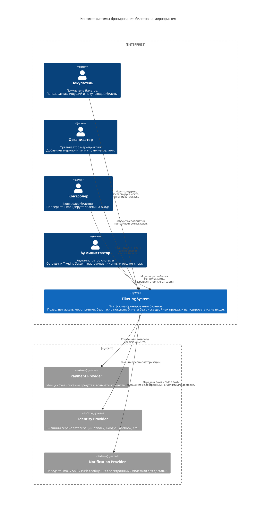
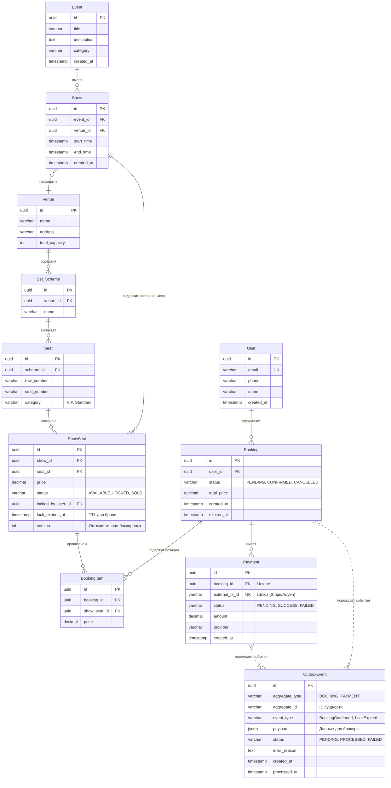

w# ДЗ 6. Проектная работа — решение

> Условие: [../Задание.md](../Задание.md). Схемы — в [diagrams/](diagrams/).

## Выбранная тема

_Система управления мероприятиями — билеты на мероприятия (Tiketing System)._

Система управления мероприятиями и продажи билетов — это система, которая позволяет организаторам создавать мероприятия(события) такие как:
- концерты;
- шоу;
- фильмы;
- спектакли;
- спортивные мероприятия;
- и т.д.

Система позволяет организаторам настраивать интерактивные схемы залов, управлять билетами на мероприятие. Покупатели могут быстро находить мероприятия, выбирать места на схеме зала и оплачивать билеты онлайн. Также система обеспечивает проверку билетов контролерами с помощью сканеров на входе на площадку.

## 1. Требования к системе

### Функциональные требования

Основные роли в системе:
- Покупатель;
- Организатор;
- Контролер;
- Администратор.

---

#### Для покупателя 

* Поиск и фильтрация: 
    * возможность искать мероприятия по жанру, городу, дате, цене и исполнителю.
* Интерактивная схема зала: 
    * выбор конкретного места на динамической карте площадки (партер, амфитеатр, ложи) с отображением статуса занятости в реальном времени.
* Покупка и оплата: 
    * корзина, возможность оплаты с помощью различных платежных систем. 
* Личный кабинет и билеты: 
    * хранение купленных билетов в виде QR-кодов. 

#### Для организатора мероприятий

- Создание конфигураций площадок (схема зала) .
- Формирование мероприятий.
- Формирование билетов на мероприятия.

#### Для администрации и контроля на площадке 

Мобильное приложение или СКУД-терминалы для валидации QR-кодов билетов на входе позволяющее валидировать билет как в online так и в offline режиме. 

### Нефункциональные требования

#### Производительность и масштабируемость 

Требования к обрабатываемому системой количеству запросов предъявляемые к различным компонентам системы.

| Компонент | Стандарт RPS | Пиковые показатели RPS |
| --------------- | --------------- | --------------- |
| Показ мероприятий (списки событий, поиск, фильтры) | 800 – 1 200 | 8 000 – 12 000 |
| Показ схем залов (интерактивная карта, загрузка сетки мест и их статусов) | 300 - 500 | 5 000 - 7 000 |
| Бронирование мест (выбор места и резервирование его на 10 мин) | 30 – 50 | 1 500 – 2 500 |
| Создание заказа и оплата (списки событий, поиск, фильтры) | 5 – 10 | 200 – 400 |


#### Время отклика (Latency)

- Поиск событий не более 500 мс.
- Отображение схемы зала — не более 1.5 секунд.
- Проверка доступности места и блокировка под сессию покупки — не более 200 мс.
- Время валидации билета сканером на входе — не более 0.3–0.5 секунд для предотвращения очередей.

#### Консистентность данных 

Строгая транзакционность. 

При выборе места пользователем оно блокируется на 10 минут для оплаты. 

Ни один другой пользователь не должен иметь возможность заблокировать или купить это же место параллельно.

#### Доступность 

Коэффициент доступности системы (SLA) — 99.9%. 

Архитектура системы должна быть отказоустойчивой и обеспечивать плавную деградацию (graceful degradation) производительности при пиковых нагрузках.


### Риски и ограничения

1. Ажиотажный спрос. (пик трафика в момент публикации события).

Риск падения системы при старте продаж билетов на сверхпопулярных артистов (например, финалы крупных мероприятий на подобии чемпионата мира по футболу или туры топ-исполнителей). 95% трафика за сутки может прийтись на первые 10 минут.

Последствия: Отказ API, недовольство пользователей, репутационные потери.

2. Овербукинг (Двойные продажи):

Риск продажи одного и того же места двум разным пользователям.

3. Атаки ботов и перекупщиков

Использование скриптов для моментального выкупа лучших мест в первые секунды продаж с целью перепродажи на сторонних площадках.

4. Сбои платежных шлюзов 

Отказ со стороны банков-эквайеров или СБП в моменты пиковых нагрузок.

5. Законодательство о возврате билетов

Четко регламентирует процент возврата средств в зависимости от того, за сколько дней до мероприятия оформлен возврат (например, за 10 дней — 100%, за 5 дней — 50%, менее чем за 3 дня — 0%, за исключением болезни). Логика возвратов в коде должна строго соответствовать этим правилам.

6. Фискализация

Обязательное формирование онлайн-чеков в момент оплаты и отправка их в ОФД. Система должна быть интегрирована с облачными кассами (АТОЛ Онлайн и др.), способными пробивать тысячи чеков в минуту.

7. Интеграция со сторонними сервисами.

При использовании сторонних интеграционных сервисов наша система в какой-то мере зависит от скорости работы стороннего API.

### Backlog 

Управление ценовыми категориями (тарифами) и квотами билетов. 
Настройка динамического ценообразования. 
Отчетность по продажам и аналитика.
Оформление возврата.
Выполнение требований законов о защите персональных данных.
Фискализация.
Защита от перекупщиков и ботов.
Интеграция со сторонними сервисами площадок.
Возможность проверять QR-коды в отсутствии интернета.


## 2. Концептуальная архитектура

```mermaid
C4Container
    title Container diagram for Tiketing System

        Person(personUser, "Покупатель", "Покупатель билетов.<br/>Пользователь, ищущий и покупающий билеты.")
        Person(personOrganizer, "Организатор", "Организатор мероприятий.<br/>Добавляет мероприятия и управляет залами.")
        Person(personController, "Контролер", "Контролер билетов.<br/>Проверяет и валидирует билеты на входе.")
        Person(personAdministrator, "Администратор", "Администратор системы<br/>Сотрудник Tiketing System, настраивает лимиты и решает споры.")

    Container_Boundary(c0, "Client layer") {
        Container(webApp, "Веб-сайт", "JavaScript", "Веб-сайт для бронирования билетов покупателями.")
        Container(mobileApp, "Мобильное бронирование", "Android/iOS", "Мобильное приложение для бронирования билетов покупателями.")
        Container(controllerApp, "Мобильное QR-сканирование", "Android/iOS", "Мобильное приложение для проверки валидности билетов.")
        Container(webAdminPortal, "Веб-сайт", "", "Веб-портал для администрирования.")
    }

    Container_Boundary(c1, "Service layer") {

        Container(ApiGateway, "API Gateway", "Kong / Nginx", "API-шлюз.<br/>- Routing<br/>- Rate Limiting<br/>- Load Balancing<br/>- Authentication")
        Container(UserService, "User Service", "", "-Аутентификация.<br/>- Профиль.")
        Container(CatalogService, "Catalog Service", "", "- Список мероприятий.<br/>- Информация о мероприятии.<br/>- Схема зала.")
        Container(BookingService, "Booking Service", "", "- Блокировка мест.<br/>- Бронирование.<br/>- Менеджмент бронирования.")
        Container(PaymentService, "Payment Service", "", "- Платежный шлюз.<br/>- Обработка сообщений от платежного шлюза.<br/>- Возврат средств.")
        Container(NotificationService, "Notification Service", "", "Рассылка сообщений:<br/>- Email<br/>- SMS<br/>- Push Notifications")
    }
    
    Container_Boundary(c2, "Data & Cache") {
        ContainerDb(postgreSQL, "Основная БД", "PostgreSQL", "- Пользователи<br/>- Бронирования<br/>-Мероприятия / места<br/>- Платежи")
        ContainerDb(redis, "Redis cache", "Redis", "- Распределённый кэш<br/>- Блокировка мест.")
        ContainerDb(elasticsearch, "Search", "Elasticsearch", "- Поиск мероприятий.")
        Container(messageBroker, "Брокер сообщений.", "Kafka", "")
        Container(storage, "Ресурсы", "S3 / CDN", "- Статическое описание мероприятий.<br/>- Схемы залов.<br/>- Билеты.")       
    }

    Boundary(ext, "") {
        System_Ext(extSystemPayment, "Payment Provider", "Инициирует списание средств и возвраты клиентам.")
        System_Ext(extSystemIdentity, "Identity Provider", "Внешний сервис авторизации. Yandex, Google, Facebook, etc...")
        System_Ext(extSystemNotification, "Notification Provider", "Передает Email / SMS / Push сообщения с электронными билетами для доставки.")
    }      

    UpdateLayoutConfig($c4ShapeInRow="4", $c4BoundaryInRow="1")
```





- Схема C4: Context + Container (в diagrams/).
- Описание компонентов (1–2 предложения на каждый).
- Обоснование архитектурного стиля.
- ADR для 2–3 ключевых решений.
- Пользователи и внешние интеграции.

## 3. Сайзинг

_RPS, хранилище, bandwidth, ресурсы и стоимость._

## 4. Хранение данных

_Выбор БД с обоснованием, шардирование, кэширование._




## 5. Взаимодействие

_Схема взаимодействия и API-контракты._

## 6. Мониторинг и оповещения

Для мониторинга метрик используем связку: Prometheus + Grafana.

Для логов системы используем связку ELK.

Для распределенных трейсов: Jaeger + Elasticsearch.


### Ключевые метрики

| | Метрика | Целевое значение | Порог оповещения (Alert Trigger) |
| :--- | :--- | :--- | :--- |
| **Бизнес-метрики и консистентность** | | | |
| 1 | Доля успешных блокировок мест (Seat Lock Success Rate) | > 95% | < 90% |
| 2 | Время подтверждения бронирования (Booking Confirmation Time) | < 2 с | > 5 с |
| 3 | Доля успешных платежей (Payment Success Rate) | > 98% | < 95% |
| 4 | Доля потерь при блокировке мест (Lock Expiry / Abandonment Rate) | < 2% | > 5% |
| 5 | Случаи двойного бронирования (Double Booking Cases) | **0** | **> 0 (КРИТИЧЕСКИЙ УРОВЕНЬ ТРЕВОГИ)** |
| 6 | Коэффициент очистки просроченных блокировок (TTL Janitor Success Rate) | 100% | < 99.9% |
| **Производительность API (Latency p99)** | | | |
| 7 | Seat API Latency (p99) | < 200 мс | > 500 мс |
| 8 | Lock API Latency (p99) | < 500 мс | > 1.2 с |
| 9 | Booking API Latency (p99) | < 1 с | > 3 с |
| 10 | Payment Webhook API Latency (p99) | < 300 мс | > 1 с |
| **Технические метрики (ошибки и очереди)** | | | |
| 11 | Частота ошибок (Error Rate) на API шлюзе (HTTP 5xx) | < 0.1% | > 1% |
| 12 | Длина очереди обработки платежей (Payment Queue Lag) | < 50 сообщений | > 500 сообщений |
| 13 | Длина очереди уведомлений (Notification Queue Lag) | < 100 сообщений | > 1000 сообщений |
| 14 | Количество дедлоков в БД (Database Deadlocks) | 0 / мин | > 2 / мин |
| 15 | Процент кэш-хитов (Cache Hit Rate) для схемы мест | > 90% | < 75% |
| **Инфраструктурные метрики** | | | |
| 16 | Утилизация CPU на инстансах сервиса блокировки | < 60% | > 85% |
| 17 | Использование пула соединений с БД (DB Connection Pool Saturation)| < 70% | > 90% |
| 18 | Репликационный лаг БД (DB Replication Lag) | < 1 с | > 5 с |
| 19 | Доступность платежного шлюза (Third-Party Payment Gateway Uptime)| > 99.9% | < 99.0% |
| 20 | Исчерпание лимитов (Rate Limit Throttling Count) | 0 | > 50 / мин |

### Дашборд

Дашборд - это инструмент визуализации состояния системы в реальном времени, который помогает решать задачи разных команд: инженеров, бизнеса, службы поддержки.

---
#### 1. Бизнес-разрез

* Доступность мест на мероприятия в реальном времени (с фильтром по топ-событиям).
* Количество активных блокировок мест (в разбивке по статусам).
* Конверсия: отношение заблокированных мест к успешно выкупленным билетам за последний час.
---

#### 2. Производительность
* Очередь обработки платежей (метрики lag и processing time для Kafka).
* Частота ошибок по эндпоинтам (с группировкой по сервисам).
* Количество запросов (RPS) на каждый критический эндпоинт.
---

#### 2. Инфраструктура
* Нагрузка на кэш-слой

Ops Per Second (RPS): Количество операций в секунду. Резкий всплеск говорит о наплыве пользователей или неоптимальном коде (например, N+1 запросы в кэш).Latency (p99): Время ответа Redis. В норме должно быть < 5–10 мс. Рост латентности — первый признак того, что Redis заблокирован «тяжелой» командой (например, случайное использование KEYS * вместо SCAN в продакшене).2. Память (Memory Management) — Критично для TTL местUsed Memory: Общий объем оперативной памяти, занятый данными. Если память закончится, Redis не сможет создавать новые блокировки мест.Memory Fragmentation Ratio: Коэффициент фрагментации памяти. Если он > 1.5, Redis потребляет значительно больше памяти ОС, чем ему реально нужно. Если < 1.0, значит, система ушла в своп (Swap), и латентность катастрофически вырастет.Evicted Keys: Количество ключей, удаленных принудительно из-за нехватки памяти (политика maxmemory-policy). На дашборде должно быть строго 0. Если места (locks) начнут вытесняться до истечения их TTL, пользователи потеряют свои брони прямо в процессе оплаты.3. Эффективность кэширования (Cache Efficiency)Cache Hit Rate: Процент успешных чтений из кэша (отношение keyspace_hits к общему числу запросов). Для схем залов целевое значение > 85–90%. Падение этого показателя означает, что запросы пошли напрямую в реляционную БД, и она может лечь под нагрузкой.Expired Keys: Количество ключей, удаленных естественным образом по истечении TTL. Помогает отслеживать, с какой скоростью освобождаются невыкупленные места.4. Надежность и Инфраструктура (Connections & Replication)Connected Clients: Количество активных подключений к Redis. Если сервисы бронирования масштабируются (автоскейлинг), они могут исчерпать лимит подключений Redis (maxclients).Blocked Clients: Количество клиентов, ожидающих ответа на блокирующие операции (например, BLPOP или транзакции). В идеале должно стремиться к 0.Replication Lag: Если используется связка Master-Replica, этот показатель отображает задержку синхронизации реплики в секундах. Рост лага опасен: при падении Master-ноды реплика может не знать о последних заблокированных местах, что приведет к Double Booking.

---


Рейт .Блок "Инфраструктурное здоровье" (Redis/Memcached CPU & Memory usage), так как именно он держит распределенные замки (locks) на места.Счетчик транзакционных абортов и таймаутов в реляционной БД.

Дашборд:
- Доступность мест на сеанс в реальном времени
- Количество активных блокировок мест
- Очередь обработки платежей
- Частота ошибок по эндпоинтам


### Логирование

Логирование должно решать две главные задачи: обеспечивать быструю локализацию сбоев (дебаг) и формировать надежный аудиторский след для разбора финансовых споров.

---

#### 1. Бизнес-логи (Жизненный цикл заказа)

Каждая запись на этом уровне должна в обязательном порядке содержать контекстные идентификаторы: `user_id`, `show_id` (ID сеанса), `lock_id` и сквозной `trace_id`.

*   **Запрос схемы мест:** 
    *   *Что писать:* Факт запроса пользователем карты зала.
    *   *Зачем:* Позволяет доказать, видел ли пользователь места свободными в интерфейсе перед попыткой их заблокировать.
*   **Инициация блокировки мест:** 
    *   *Что писать:* Время запроса, `user_id`, массив `seat_ids` (номера мест), `show_id`.
*   **Результат блокировки:**
    *   *Успех:* Создание `lock_id`, фиксация точного времени истечения блокировки (`expire_at` / TTL).
    *   *Отказ:* Причина отказа.
*   **Создание платежной сессии:** 
    *   *Что писать:* Создание транзакции, `invoice_id`, сумма, валюта, выбранный платежный шлюз.
*   **Обработка платежных вебхуков (Callbacks):** 
    *   *Что писать:* Сырой (но отфильтрованный) ответ от платежной системы, внутренний `payment_id`, статус и **внутренний код ошибки провайдера** (например, `INSUFFICIENT_FUNDS`, `CARD_EXPIRED`).
*   **Финальное подтверждение (Confirmation):** 
    *   *Что писать:* Снятие временного TTL-замка, перевод брони в финальный статус, факт успешной генерации билетов и QR-кодов.
*   **???Автоматическая отмена по таймауту (TTL Expiry):** 
    *   *Что писать:* Срабатывание воркера очистки (Janitor), перевод мест обратно в статус `AVAILABLE`. 
    *   *Зачем:* Критично для дебага жалоб в поддержку в стиле: *"Я оплатил, а билет не пришел"*. Помогает увидеть, что оплата пришла позже, чем сработал таймаут отмены.

---

#### 2. Системные и инфраструктурные логи

Используются инженерной командой для мониторинга технического здоровья сервисов.

*   **Взаимодействие с внешними API:** Входящие и исходящие HTTP/gRPC запросы, время их обработки (latency), сетевые таймауты и HTTP-статусы ответов (особенно от платежных шлюзов).
*   **Ошибки слоя данных (СУБД и Кэш):** 
    *   Таймауты подключения к БД и исчерпание пулов соединений.
    *   Ошибки блокировок в БД: случаи обнаружения дедлоков.
    *   Ошибки записи распределенных замков в Redis.
*   **Ошибки очередей сообщений:**
    *   Ошибки сериализации/десериализации схем.
    *   Факты отправки поврежденных или необработанных сообщений в **DLQ (Dead Letter Queue)**.
*   **Изменение конфигурации (Feature Flags):** Динамическое изменение таймаутов блокировки, переключение платежных шлюзов и т.д.

---

#### 3. Аудит и Безопасность (Security Logs)

Используются для фиксации действий администраторов и для разбора спорных ситуаций.

*   **Действия администраторов:** Любые изменения цен, ручные отмены бронирований, проведение возвратов (Refunds), изменение расписания сеансов (с указанием `admin_id`).
*   **Подозрительная активность:** Срабатывание ограничений Rate Limiter (например, если один IP или `user_id` пытается заблокировать 50 мест в разных залах за секунду).
*   **Сбои аутентификации:** Попытки обращения к API с просроченными JWT-токенами или попытки деблокировать чужой `lock_id`.

---

#### Запрещается логировать

Во избежание компрометации данных и получения штрафов, на уровне API-шлюза настраиваются маскирующие фильтры, которые вырезают из логов:

1. **Данные банковских карт:** Полный номер карты (PAN), CVV/CVC-коды, ПИН-коды, срок действия карты. Номер карты допускается писать исключительно в замаскированном виде: `411111******1111`.
2. **Чувствительные персональные данные:** Незашифрованные пароли пользователей, сессионные токены, куки.
3. **Нефильтрованные тела ответов:** Ответы от сторонних платежных систем перед записью в лог должны проходить через санитайзер, чтобы исключить случайную утечку платежных данных клиента, возвращенных шлюзом.

---

#### Шаблон структурированного лога (JSON)

Все логи в системе должны быть структурированными (JSON), чтобы их мог эффективно парсить агрегатор логов (ELK).

```json
{
  "timestamp": "2026-09-22T13:02:00.123Z",
  "level": "INFO",
  "service": "booking-service",
  "trace_id": "9f8a7b6c5d4e3f2a1b0c9d8e7f6a5b4c",
  "message": "Seat lock successfully created",
  "context": {
    "user_id": "usr_9921",
    "lock_id": "lck_881273",
    "show_id": "show_451",
    "seat_ids": ["12", "13"],
    "ttl_seconds": 600
  }
}
```