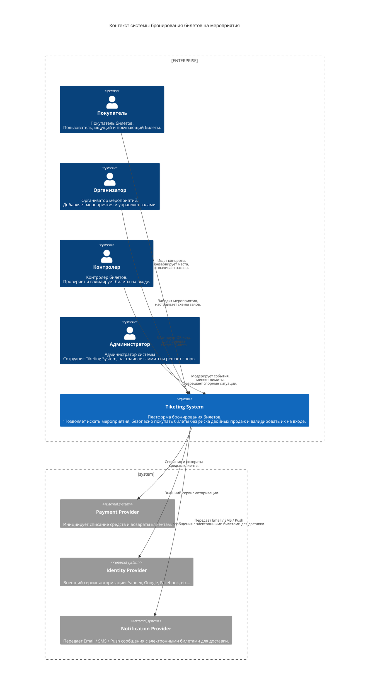

w# ДЗ 6. Проектная работа — решение

> Условие: [../Задание.md](../Задание.md). Схемы — в [diagrams/](diagrams/).

## Выбранная тема

_Система управления мероприятиями — билеты на мероприятия (Tiketing System)._

Система управления мероприятиями и продажи билетов — это система, которая позволяет организаторам создавать мероприятия(события), настраивать интерактивные схемы залов, управлять билетами на мероприятие. Покупатели могут быстро находить концерты, выбирать места на схеме и оплачивать билеты онлайн. Система обеспечивает  проверку билетов контролерами с помощью сканеров на входе на площадку.

## 1. Требования

### Функциональные

Основные роли в системе:
- Покупатель;
- Организатор;
- Контролер;

#### Для покупателя 

Поиск и фильтрация: Возможность искать мероприятия по жанру, городу, дате, цене и исполнителю.

Интерактивная схема зала: Выбор конкретного места на динамической карте площадки (партер, амфитеатр, ложи) с отображением статуса занятости в реальном времени.

Покупка и оплата: Корзина, интеграция со СБП, картами, частями (сплит) и экосистемными баллами (например, Яндекс Плюс). 

Личный кабинет и Билеты: Хранение купленных билетов в виде QR-кодов. 

#### Для организатора мероприятий

Создание конфигураций площадок (схема зала) .
Формирование мероприятий.
ФОрмирование билетов на мероприятия.

#### Для администрации и контроля на площадке 

Мобильное приложение или СКУД-терминалы для валидации QR-кодов билетов на входе.

### Нефункциональные

#### Производительность и масштабируемость 

Требования к обрабатываемому системой количеству запросов предъявляемые к различным компонентам системы.

| Компонент | Стандарт RPS | Пиковые показатели RPS |
| --------------- | --------------- | --------------- |
| Показ мероприятий (списки событий, поиск, фильтры) | 800 – 1 200 | 8 000 – 12 000 |
| Показ схем залов (интерактивная карта, загрузка сетки мест и их статусов) | 300 - 500 | 5 000 - 7 000 |
| Бронирование мест (выбор места и резервирование его на 10 мин) | 30 – 50 | 1 500 – 2 500 |
| Создание заказа и оплата (списки событий, поиск, фильтры) | 5 – 10 | 200 – 400 |

#### Время отклика (Latency)

Поиск событий не более 500 мс.

Отображение схемы зала — не более 1.5 секунд.

Проверка доступности места и блокировка под сессию покупки — не более 200 мс.

Время валидации билета сканером на входе — не более 0.3–0.5 секунд для предотвращения очередей.

#### Консистентность данных 

Строгая транзакционность. 

При выборе места пользователем оно блокируется на 10 минут для оплаты. 

Ни один другой пользователь не должен иметь возможность заблокировать или купить это же место параллельно.

#### Доступность 

Коэффициент доступности системы (SLA) — 99.9%. 

Архитектура должна быть отказоустойчивой.

### Риски и ограничения

1. Ажиотажный спрос. (пик трафика в момент публикации события).

Риск падения системы при старте продаж билетов на сверхпопулярных артистов (например, финалы крупных мероприятий на подобии чемпионата мира по футболу или туры топ-исполнителей). 95% трафика за сутки может прийтись на первые 10 минут.

Последствия: Отказ API, недовольство пользователей, репутационные потери.

2. Овербукинг (Двойные продажи):

Риск продажи одного и того же места двум разным пользователям.

3. Атаки ботов и перекупщиков

Использование скриптов для моментального выкупа лучших мест в первые секунды продаж с целью перепродажи на сторонних площадках.

4. Сбои платежных шлюзов 

Отказ со стороны банков-эквайеров или СБП в моменты пиковых нагрузок.

5. Законодательство о возврате билетов

Четко регламентирует процент возврата средств в зависимости от того, за сколько дней до мероприятия оформлен возврат (например, за 10 дней — 100%, за 5 дней — 50%, менее чем за 3 дня — 0%, за исключением болезни). Логика возвратов в коде должна строго соответствовать этим правилам.

6. Фискализация

Обязательное формирование онлайн-чеков в момент оплаты и отправка их в ОФД. Система должна быть интегрирована с облачными кассами (АТОЛ Онлайн и др.), способными пробивать тысячи чеков в минуту.

7. Интеграция со сторонними сервисами.

При использовании сторонних интеграционных сервисов наша система в какой-то мере зависит от скорости работы стороннего API.

### Backlog 

Управление ценовыми категориями (тарифами) и квотами билетов. 
Настройка динамического ценообразования. 
Отчетность по продажам и аналитика.
Оформление возврата.
Выполнение требований законов о защите персональных данных.
Фискализация.
Защита от перекупщиков и ботов.
Интеграция со сторонними сервисами площадок.
Возможность проверять QR-коды в отсутствии интернета.

## 2. Концептуальная архитектура

```mermaid
C4Container
    title Container diagram for Tiketing System

        Person(personUser, "Покупатель", "Покупатель билетов.<br/>Пользователь, ищущий и покупающий билеты.")
        Person(personOrganizer, "Организатор", "Организатор мероприятий.<br/>Добавляет мероприятия и управляет залами.")
        Person(personController, "Контролер", "Контролер билетов.<br/>Проверяет и валидирует билеты на входе.")
        Person(personAdministrator, "Администратор", "Администратор системы<br/>Сотрудник Tiketing System, настраивает лимиты и решает споры.")

    Container_Boundary(c0, "Client layer") {
        Container(webApp, "Веб-сайт", "JavaScript", "Веб-сайт для бронирования билетов покупателями.")
        Container(mobileApp, "Мобильное бронирование", "Android/iOS", "Мобильное приложение для бронирования билетов покупателями.")
        Container(controllerApp, "Мобильное QR-сканирование", "Android/iOS", "Мобильное приложение для проверки валидности билетов.")
        Container(webAdminPortal, "Веб-сайт", "", "Веб-портал для администрирования.")
    }

    Container_Boundary(c1, "Service layer") {

        Container(ApiGateway, "API Gateway", "Kong / Nginx", "API-шлюз.<br/>- Rate Limiting<br/>- Load Balancing<br/>- Authentication ")
        Container(UserService, "Сервис пользователей.", "", "-Аутентификация.<br/>- Профиль.")
        Container(CatalogService, "Сервис каталога мероприятий.", "", "- Список мероприятий.<br/>- Информация о мероприятии.<br/>- Схема зала.")
        Container(BookingService, "Сервис бронирования мест.", "", "- Блокировка мест.<br/>- Бронирование.<br/>- Менеджмент бронирования.")
        Container(PaymentService, "Сервис оплаты.", "", "- Платежный шлюз.<br/>- Обработка сообщений от платежного шлюза.<br/>- Возврат средств.")
        Container(NotificationService, "Серис уведомлений.", "", "Рассылка сообщений:<br/>- Email<br/>- SMS<br/>- Push Notifications")
    }
    
    Container_Boundary(c2, "Data & Cache") {
        ContainerDb(postgreSQL, "Основная БД", "PostgreSQL", "- Пользователи<br/>- Бронирования<br/>-Мероприятия / места<br/>- Платежи")
        ContainerDb(redis, "Redis cache", "Redis", "- Распределённый кэш<br/>- Блокировка мест.")
        ContainerDb(elasticsearch, "Search", "Elasticsearch", "- Поиск мероприятий.")
        Container(messageBroker, "Брокер сообщений.", "Kafka", "")
        Container(storage, "Ресурсы", "S3 / CDN", "- Статическое описание мероприятий.<br/>- Схемы залов.<br/>- Билеты.")       
    }

    Boundary(ext, "") {
        System_Ext(extSystemPayment, "Payment Provider", "Инициирует списание средств и возвраты клиентам.")
        System_Ext(extSystemIdentity, "Identity Provider", "Внешний сервис авторизации. Yandex, Google, Facebook, etc...")
        System_Ext(extSystemNotification, "Notification Provider", "Передает Email / SMS / Push сообщения с электронными билетами для доставки.")
    }      

    Container_Boundary(c3, "Monitoring & Observability") {
        Container(prometheus, "Мониторинг.", "Prometheus + Grafana", "")
        Container(elk, "Логирование.", "ELK stack", "")
        Container(tracing, "Рапрседеленная трассировка.", "Jaeger", "")
    }

    UpdateLayoutConfig($c4ShapeInRow="4", $c4BoundaryInRow="1")

```

- Схема C4: Context + Container (в diagrams/).
- Описание компонентов (1–2 предложения на каждый).
- Обоснование архитектурного стиля.
- ADR для 2–3 ключевых решений.
- Пользователи и внешние интеграции.

## 3. Сайзинг

_RPS, хранилище, bandwidth, ресурсы и стоимость._

## 4. Хранение данных

_Выбор БД с обоснованием, шардирование, кэширование._

## 5. Взаимодействие

_Схема взаимодействия и API-контракты._

## 6. Мониторинг и оповещения

Ключевые метрики:
1. Доля успешных блокировок мест 
- Целевое значение: > 95%
- Порог оповещения: < 90%

2. Время подтверждения бронирования
- Целевое значение: < 2 с
- Порог оповещения: > 5 с

3. Доля успешных платежей
- Целевое значение: > 98%
- Порог оповещения: < 95%

4. Доля потерь при блокировке мест
- Целевое значение: < 2%
- Порог оповещения: > 5%

5. Случаи двойного бронирования
- Целевое значение: 0
- Порог оповещения: > 0 (**КРИТИЧЕСКИЙ УРОВЕНЬ ТРЕВОГИ**)

6. Латентсность API (перцентиль p99)
- Seat API: < 200 мс
- Lock API: < 500 мс
- Booking API: < 1 с

Дашборд:
- Доступность мест на сеанс в реальном времени
- Количество активных блокировок мест
- Очередь обработки платежей
- Частота ошибок по эндпоинтам
